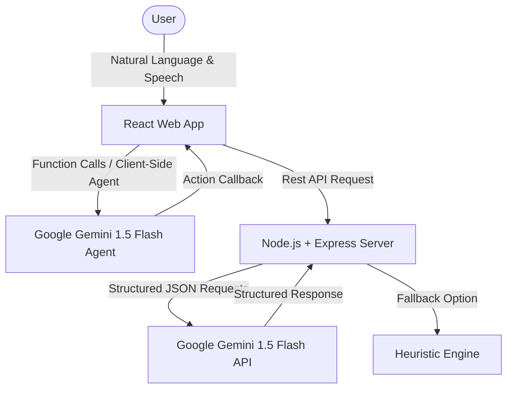

# Demo-App Link : https://aegis-zen-app-571223675384.us-central1.run.app/
# 🛡️ Aegis Zen — AI-Powered Productivity Guardian & Burnout Prevention Sanctuary

> **Aegis Zen** is a next-generation personal productivity sanctuary designed to protect cognitive bandwidth, automate recovery replanning, and prevent burnout. Combining a serene, glassmorphic user experience with advanced generative AI, it helps knowledge workers structure their day around a strict energy budget and recover gracefully when life gets in the way.

---

## 📌 Problem Statement Selected

### **The Burnout Epidemic in Modern Workloads**
In the era of hyper-connectivity and endless to-do lists, modern knowledge workers are experiencing unprecedented levels of cognitive exhaustion and burnout. Traditional productivity tools (calendars, task managers, kanban boards) are passive:
* **Time over energy:** They treat time as infinite and tasks as identical, ignoring the mental energy required for different types of work.
* **No proactive guardrails:** They allow users to over-schedule themselves with no warnings of impending cognitive fatigue.
* **Anxiety-inducing failures:** They offer no guidance or auto-recovery options when deadlines are missed or tasks overflow, leading to stress-induced procrastination.
* **Machine-like expectations:** They do not consider the user's mental or physical state, treating humans like machines.

### **The Aegis Zen Solution**
**Aegis Zen** shifts the paradigm from *ruthless execution* to *mindful productivity*. It treats human energy as a finite daily budget and acts as an intelligent guardian that actively structures, balances, and adapts workloads to preserve mental health.

---

## 💡 Solution Overview

Aegis Zen is built as a unified monorepo featuring a **React + Vite** client-side application and a **Node.js + Express** backend, working in tandem with the **Google Gemini 1.5 Flash** model. 



### **Core Design Philosophy**
1. **Energy Budgeting:** Rather than just tracking hours, tasks are rated on a *Cognitive Load* scale (1-5 units). Daily workloads are strictly monitored against a **15 cognitive unit budget** to prevent overload.
2. **Dynamic Adaptation:** If tasks fall behind, the **Aegis Guardian** system steps in to suggest recovery paths (delaying, moving, or preserving tasks) instead of letting red overdue alerts build anxiety.
3. **Conversational Agent Loop:** An integrated client-side assistant listens to voice or text inputs, calling native calendar and task operations dynamically using Gemini Function Calling.
4. **Heuristic Fallback:** If API keys are missing or rate limits are reached, Aegis has a built-in deterministic heuristic rule engine to ensure the tool remains fully functional offline.

---

## ✨ Key Features

Aegis Zen provides a comprehensive suite of cognitive health and planning features:

### 📅 1. Aegis Flow Planner
Analyze task priorities and estimate durations automatically. Generates a beautifully balanced, box-scheduled daily calendar containing task blocks alternating with structured resting breaks.

### 🛡️ 2. Aegis Guardian (Smart Recovery)
Detects overdue items or tasks running past their scheduled slots. Rather than failing, Aegis triggers an interactive recovery planner suggesting optimal actions:
* **Move:** Shifting tasks to open slots later today.
* **Delay:** Postponing non-critical tasks to a future date.
* **Preserve:** Locking high-priority tasks in place.

### 🧠 3. Real-Time Cognitive Load & Burnout Index
Tracks the active task list and daily calendar events to display a real-time **Cognitive Load Metric (0-100)** and a **Burnout Risk Score**. Categorizes user state into *Healthy, Moderate, High, or Critical* with actionable Zen interventions.

### 🔮 4. Future Self Timeline Simulation
Projects current habits and schedule structures into four distinct future scenarios (Scenario A-D) outlining task completion probability, stress levels, goal success rates, and narrative warnings of where the user will be in 3 months if habits remain unchanged.

### 📝 5. Chaos Brain Dump Parser
Pasted chaotic notes, dates, or unformatted text are parsed instantly using AI. Aegis extracts task titles, categories, durations, and due dates, then previews them as structured cards before adding them to the schedule.

### 🎙️ 6. Voice Accountability Coach
An interactive voice-guided check-in system using browser Speech Recognition. Aegis checks on active tasks, listens to the user's progress report, and uses AI to evaluate task status, offering warm or grounding feedback.

### 🧘 7. Automatic Box-Breathing Widget
A 4-4-4-4 cycle (Inhale, Hold, Exhale, Hold) breathing guide designed to reduce cortisol. Triggered automatically after completing high-load tasks (cognitive rating 5) or manually upon request.

---

## 🛠️ Technologies Used

* **Frontend:**
  * **React 19** & **Vite 8** for lightning-fast HMR and build performance.
  * **Vanilla CSS** with custom property tokens for premium dark mode aesthetics, smooth animations, and glassmorphism.
  * **Lucide React** for high-quality, modern stroke icons.
  * **Web Speech API** for hands-free voice coaching (Speech Recognition & Speech Synthesis).
* **Backend:**
  * **Node.js** with **Express 5** for API routing.
  * **Cors** and **Dotenv** for secure, cross-origin resource sharing and configuration.
* **DevOps & Containers:**
  * **Docker** multi-stage builds (`Dockerfile` & `.dockerignore`) configured to package frontend assets and run the monorepo node server.

---

## 🚀 Google Technologies Utilized

Aegis Zen leverages Google's AI ecosystem as the core intelligence layer:

1. **Google Gemini API (`@google/generative-ai` SDK):** Powered directly on both backend services and client-side scripts.
2. **Gemini 1.5 Flash (`gemini-1.5-flash`):** Used as the primary model for all AI capabilities due to its high speed, low latency, and robust instruction-following performance.
3. **Structured Outputs (JSON Schema Enforcements):** Every backend endpoint uses Gemini's `responseSchema` configurations (e.g. `PLANNER_RESPONSE_SCHEMA`, `BURNOUT_RESPONSE_SCHEMA`, `SIMULATION_RESPONSE_SCHEMA`) to guarantee conformant JSON parses without prompt formatting issues.
4. **Gemini Function Calling (Tools):** The client-side chat interface wraps Gemini in a conversational agent setup, exposing operations like `addTask`, `scheduleTask`, `updateTask`, `deleteTask`, `listTasks`, and `triggerBreathingBreak` as functional tools the AI can invoke dynamically.
5. **Google Fonts (Outfit & Plus Jakarta Sans):** Premium typography integrated via Google's Font CDN to ensure sleek, readable, and modern interface design.
6. **Google Cloud Run Ready:** Packaged with an optimized monorepo Dockerfile that exposes port `8080` (aligning with Google Cloud Run specifications) to allow seamless deployment.

---

## ⚙️ Running Locally

### **Prerequisites**
* Node.js v18 or higher
* A Gemini API Key from [Google AI Studio](https://aistudio.google.com/)

### **Installation & Startup**

1. Clone this repository.
2. Install dependencies for both frontend and backend:
   ```bash
   npm run install-all
   ```
3. Create a `.env` file in the `backend` folder and add your API key:
   ```env
   GEMINI_API_KEY=your_gemini_api_key_here
   ```
4. Start both servers in development mode:
   ```bash
   npm run dev
   ```
5. Open your browser and navigate to `http://localhost:5173` (Frontend) or `http://localhost:5000` (Backend).

### **Docker Execution**
To run the unified application container locally:
```bash
docker build -t aegis-zen .
docker run -p 8080:8080 -e GEMINI_API_KEY=your_gemini_api_key_here aegis-zen
```
