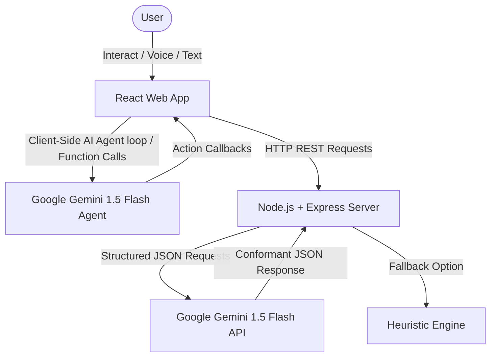

# 🛡️ Aegis Zen Architecture

Aegis Zen is built as a modular monorepo containing a high-performance React frontend and a stateless Node.js + Express backend. The project focuses on cognitive bandwidth preservation and burnout prevention through visual excellence and structured Google Gemini AI integration.

---

## High-Level Data Flow



---

## Repository Structure

The project follows a standard monorepo folder structure:

```
aegis-zen/
├── Dockerfile                   # Multi-stage Docker deployment config
├── README.md                    # Main readme and overview
├── package.json                 # Monorepo task scripts
├── backend/                     # Express REST backend
│   ├── app.js                   # Application middleware & routing setup
│   ├── server.js                # Port initialization
│   ├── config/                  # Mongoose DB configuration
│   ├── controllers/             # HTTP request/response mappings
│   ├── heuristics/              # Heuristic fallback rules (offline-ready)
│   ├── middleware/              # API key resolution and error handling middlewares
│   ├── models/                  # Mongoose Database collection schemas
│   ├── prompts/                 # Modular instruction formatting
│   ├── routes/                  # Express endpoint bindings
│   ├── schemas/                 # Gemini responseSchema schemas
│   ├── services/                # Core business logic & Gemini API triggers
│   └── utils/                   # Time parsing & cache utils
└── frontend/                    # Vite + React SPA
    ├── index.html
    └── src/
        ├── App.jsx              # Main App layout, dashboard, state
        ├── index.css            # Base styles, variables, premium dark theme
        ├── demoData.js          # Preloaded data for immediate preview
        ├── userData.js          # Blank initial state definitions
        ├── gemini.js            # Client-side agentic loop & tool callbacks
        └── components/          # Dashboard modular widgets
            ├── CognitiveLoad.jsx   # Bandwidth gauges & warnings
            ├── DailyBriefing.jsx   # Ambient greeting & priorities
            ├── SmartRecovery.jsx   # Interactive task overflow re-scheduler
            └── WeeklyOptimizer.jsx # High-level weekly balance advisor

```

---

## Monorepo Components

### 1. Client-Side Web Application (`frontend/`)
- **Technology Stack**: React 19, Vite 8, Vanilla CSS (leveraging custom CSS custom properties/tokens for dark mode, glassmorphism, animations).
- **Core State**: Managed inside [App.jsx](file:///run/media/oberoi/New%20Volume/Study/Projects/aegis-zen/frontend/src/App.jsx). It coordinates user tasks, calendar events, habits, and notifications.
- **Client-Side Agentic Loop**: Injected via the `ProductivityAgent` class (in [gemini.js](file:///run/media/oberoi/New%20Volume/Study/Projects/aegis-zen/frontend/src/gemini.js)). It wraps a Gemini 1.5 Flash chat session, utilizing system instructions and local function declarations (tools configuration) to dynamically modify client-side tasks and calendar states on behalf of the user.

### 2. Service Backend API (`backend/`)
- **Technology Stack**: Node.js, Express 5.
- **Stateless Execution**: The backend maintains no persistent databases. Instead, it accepts client payloads (tasks, events, habits), compiles them into specialized prompts, and passes them to the Gemini API with structured JSON schemas to return immediate actionable calculations.
- **Heuristic Fallback Design**: Every controller/service wrapper has a catch block. If the Gemini API key is missing or calls fail (e.g. rate limits), the backend routes dynamically fall back to local heuristic functions inside `src/heuristics/` to ensure offline availability and robustness.

---

## Google Gemini Integration

Aegis Zen places Google Gemini 1.5 Flash at the heart of its intelligence layer through two distinct mechanisms:

### A. Client-Side Agent & Function Calling (Tools)
For natural voice/text interaction, the client registers system commands as structured schemas in the model initialization:
1. `addTask`: Extracts title, category, priority, due date, duration, and energy load.
2. `scheduleTask`: Places an existing task block into a time slot.
3. `updateTask`: Modifies task properties.
4. `deleteTask`: Removes items.
5. `listTasks` / `listCalendarEvents`: Reads the current state back into the chat context.
6. `triggerBreathingBreak`: Displays the box-breathing timer during high-stress moments.

### B. Server-Side Structured Output (JSON Enforcements)
To ensure reliable, crash-proof REST payloads, the backend utilizes Gemini's response schema enforcement parameter (`responseSchema`). By supplying JSON schemas, the AI returns parseable objects matching:
- `BRIEFING_RESPONSE_SCHEMA` (in `schemas/briefing.schema.js`)
- `BURNOUT_RESPONSE_SCHEMA` (in `schemas/burnout.schema.js`)
- `PLANNER_RESPONSE_SCHEMA` (in `schemas/planner.schema.js`)
- `SIMULATION_RESPONSE_SCHEMA` (in `schemas/simulation.schema.js`)

---

## Robustness & Fallback Design

```
                     ┌──────────────────┐
                     │   Incoming API   │
                     │     Request      │
                     └────────┬─────────┘
                              │
                    ┌─────────▼─────────┐
                    │ Resolve API Key?  │
                    └────┬──────────┬───┘
                         │          │
                 Yes     │          │ No / Error
            ┌────────────▼───┐  ┌───▼────────────┐
            │ Send to Gemini │  │ Call Heuristic │
            │   with Schema  │  │ Fallback Rule  │
            └────────────┬───┘  └───┬────────────┘
                         │          │
                         └────┬─────┘
                              │
                     ┌────────▼─────────┐
                     │ Express Payload  │
                     │  JSON Response   │
                     └──────────────────┘
```

The fallback system guarantees that basic productivity features function without active internet or credentials.
- **Rescheduling & Overflow Fallbacks**: Deterministic shifting of overdue slots to next-available hourly spaces.
- **Burnout Fallbacks**: Evaluates task counts and cumulative cognitive load units through standard mathematical weights.
- **Chaos parser fallback**: Uses regex and word splitting to attempt task extraction offline.
